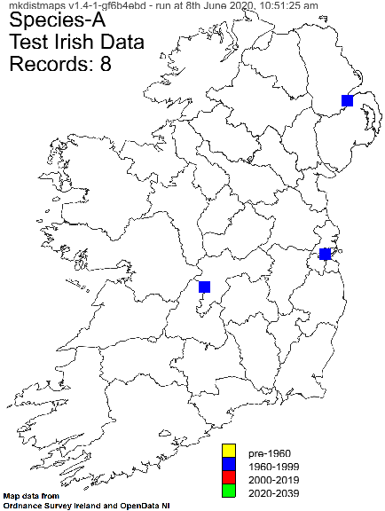
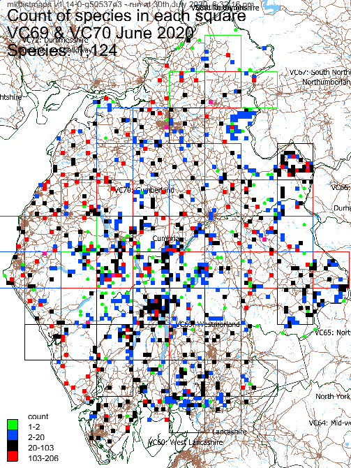
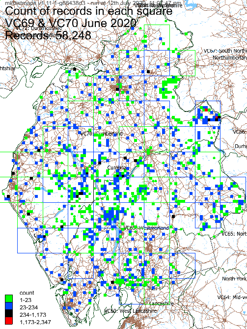

# mkdistmaps

<!--[](https://travis-ci.com/github/chriscant/mkdistmaps)-->
[](https://circleci.com/gh/chriscant/mkdistmaps)
[](https://coveralls.io/github/chriscant/mkdistmaps?branch=main)
[](https://standardjs.com)
<a href="https://sonarcloud.io/dashboard?id=chriscant_mkdistmaps"></a>


Command line tool to make species distribution maps from species records with grid references.
Generated maps are either PNGs on top of a base layer image or geojson files.

Your data can (currently) contain either [GB](https://en.wikipedia.org/wiki/Ordnance_Survey_National_Grid)
or [Irish](https://en.wikipedia.org/wiki/Irish_grid_reference_system) grid references, but not both.
GB grid references start with two letters; Irish grid references start with one letter.
The code handles 2, 4, 6, 8 or 10 numbers after the initial letter(s), 
and also recognises tetrad grid references such as `NY12Z` and quadrants such as `SD11NW`.

By default, the generated maps are coloured grouped according to the most recent record in each monad/tetrad or hectad.
You can opt to group by the number of records in each square and have an overview map showing how many species are in each square.

You can see example generated geojson maps for lichens in Cumbria at the 
[Cumbria Lichens and Bryophytes](https://cumbrialichensbryophytes.org.uk/lichen-species-maps/) website.

# Usage: Creating a distribution map PNG image

Ensure you have [git](https://git-scm.com/downloads) and [nodejs](https://nodejs.org/en/download/) installed.
You will also need your records in CSV format and a base map image.

At a suitable command line prompt:
```
git clone https://github.com/chriscant/mkdistmaps.git
cd mkdistmaps
npm install

```

* Now get your CSV of records and a basemap image into the new `mkdistmaps` directory
* Make a text file to configure the run eg [sample-config.json](sample-config.json) which you can rename to have a txt extension if that's easier eg `vc101-config.txt`
* Edit your config file to specify your CSV file(s), an output directory and other options
* Set the CSV file encoding if need be
* Now run mkdistmaps at the command line, specifying your config file:

```
node mkdistmaps.js vc101-config.txt
```
Or more simply:
```
node . vc101-config.txt
```

The code reads all the records in the specified CSV file(s) and then creates one PNG map for each found species in the output folder.
A monad, tetrad or hectad is coloured in if there are records for that species in that square.
The fill colour is determined by **maptype** eg the date of the most recent record for that square.

Set **boxSize** to `hectad` to only draw hectads, `tetrad` to draw hectads and tetrads, `monad` to draw hectads and monads and 
`all` to draw hectads, quadrants, tetrads and monads.
If on `monad` then tetrad grid references are assigned to the lower left monad.

If you opt to make monad or tetrad maps, then:
* the monad/tetrad is shown as a circle if there is only one record for the monad or tetrad
* any records that are only at hectad level are shown as outline squares, rather than filled squares

The mkdistmaps version string and the runtime date and time are added in grey at the top left of each generated map.

**Example monad maps:**

Both these monad-level maps use the same data (all records of *Aspicilia calcarea* in VC69 and VC70, Cumbria, as of June 2020).
The first shows the data on a map of Cumbria.
The second shows the data on a map of most of Great Britain.


**Example hectad map:**

This map shows some records of *Peltigera horizontalis* across GB, displayed at hectad resolution.


**Example Irish hectad map:**



**Example record and species count maps:**





**Runtime output**

The code generates basic output as it processes the data, finishing like this:

```
...
Parsed 58248 rows
Errors 1
#0 LC0003050000XIWC Date invalid:undefined Year:NaN
Errors 0
Species: 1,124
Genera: 296
Records: 58,248
Empty rows: 0
Boxes: 998
Runtime: 191 seconds
```

# Usage: GeoJson output

If you set the **outputtype** to be `geojson` then [geojson](https://en.wikipedia.org/wiki/GeoJSON) format files are generated
using standard FeatureCollection, Feature and Polygon object types, with the coordinates output in WGS84 latitude and longitude. 
Various other objects are also included to help make better maps,
ie to give the map a name, show the legend and define popup text for each feature.

A root level `style` property is defined as per [Geojson CSS](https://wiki.openstreetmap.org/wiki/Geojson_CSS):

```
"style": {
  "color": "#000000",
  "fillOpacity": 0.1,
  "weight": 1,
  "opacity": 1
},
```

In addition, various root `properties` are set, eg:
```
"properties": 
{
  "name": "Count of species in each square",
  "set": "VC69 & VC70 June 2020",
  "maptype": "count",
  "datecolours": [],
  "generator": "mkdistmaps v1.13-3-g78cb606 - run at 25th July 2020, 2:58:11 pm",
  "subtitle": "Species: 1,124",
  "countcolours": []
}
```

Finally, each defined polygon feature may have `properties` defined, where `species` is only provided on the "All species" count map.
```
"properties": {
  "color": "#008000",
  "text": "SD29: 2 species 1944-1946",
  "species": "Arthrorhaphis citrinella|Micarea lignaria var. lignaria"
}
```

## Updates

If the code at github has been updated, you can update your local copy using this command in the `mkdistmaps` directory:

```
git pull
```

You may also need to run this to install any new dependencies:
```
npm install
```


## Usage: configuration

Specify what you want done in a configuration file.
The config file must be in [JavaScript Object Notation (JSON) format](https://www.w3schools.com/js/js_json.asp).
The sample config file [sample-config.json](sample-config.json) shows some of the options available.

### limit

* If you want to test what the maps look like without generating them all, specify the number of species maps that you want to produce, eg 1. Zero means all.

### outputFolder

* Specify the output folder, which is created if need be

### saveSpacesAs

* By default, the generated map filenames will contain spaces (if the species names have spaces). 
If you want these changed, specify an alternative eg `_` to use an underscore instead.

### recordset

* **csv** - path to csv, optionally including wildcard asterisks
* **encoding** - set CSV file encoding eg to `latin1`. The default is `utf8`.
* **title** - text that is added to every generated map
* **GRCol** - name of the CSV column that contains the grid reference
* **TaxonCol** - name of the CSV column that contains the species name
* **ObsKeyCol** - optional name of the CSV column containing an observation key - used to show errors
* **DateCol** - specify either this or **YearCol** as the name of the CSV column containing the date
* **YearCol** - name of the CSV column containing the year
* **DateFormats** - optional date formats tried. The default is `[ "DD/MM/YYYY", "YYYY" ]` - [see here for format details](https://momentjs.com/docs/#/parsing/string-formats/)
* **headers** - optional array of strings containing the CSV column names
* **renameHeaders** - optional specify `true` to replace the CSV header line with that in **headers**. The default is `false`

If your CSV file doesn't contains a header line, then supply the column names in **headers**.

If your CSV files does contain a header line but it contains duplicate column names, then you can replace it with the 
column names given in **headers** and set **renameHeaders** to `true`.  Here is an example for **headers**:

`[ "Location", "Grid ref", "VC", "checked?", "Recorders", "Date(s)", "Altitude", "Site and visit comments", "BLS no.", "Species", "BLS no.2", "Taxon name", "Group", "Status", "Substrate", "Small scale habitats", "Abundance", "Record notes", "Herbarium", "Specimen", "Determiner" ]`

Note: if the CSV file has columns `Eastings` and `Northings` then these are cross-checked against the grid reference.

### boxSize

* Set to `hectad`, `tetrad` or `monad`. Default is `hectad`.

### makeGenusMaps

* Optionally specify `true` to make maps for each genus ie the first word of all species names. Default is `false`.

The genus maps will have "-all" added after the first word (which should result in the genus map displaying first in a directory listing).
If there is one record each of "Bacidia" and "Bacidia rubella" then three maps will be produced:
"Bacidia", "Bacidia rubella" and "Bacidia -all" with the last one showing 2 records.

### makeAllMap

* Optionally specify `true` to make a map for each species found called "All records". Default is `false`.
A map called "All species" is also made if **maptype** is `count`

### maptype

* Optionally specify `count` to colour squares according to the record-count in each square, using the **countcolours** ranges.
If **makeAllMap** is `true` then maps are generated called "All records" and "All species".

The default is `date` which uses the date or years fields and the **datecolours** ranges.

### outputtype

* Optionally specify `geojson` to make geojson files instead of maps.

### geojsonprecision

* Optionally specify the precision of coordinates in geojson files. The default of `false` gives full precision; in practice eg `6` will suffice.

### font_filename

* Specify the filename of a font eg a TTF file. The tests directory contains an open source font "tests/fonts/SourceSansPro-Regular.ttf".

### font_colour

* Specify the colour of the written text eg as `#000000` or `rgba(0,255,0, 1)`

### basemap

The base map would typically be generated in QGIS using "Export as image", noting the N/W/E/S values

* **file** - path to the base map: must be PNG, JPG or JPEG
* **north** - north bound of supplied base map
* **west** - west bound of supplied base map
* **east** - east bound of supplied base map
* **south** - south bound of supplied base map
* **scaledown** - scale reduction factor for output 
* **showhectadname** - set to `true` to show the hectad name on each map

The following basemap parameters determine where and how descriptive text and the legend are written onto the map

* **legend_hide** - set to true to not show a legend
* **title_x**: X position of start of text. Default: 10
* **title_y**: Y position of start of text. Default: 10
* **title_y_inc**: Y increment for next lines of text. Default: 25
* **title_fontsize**: Title text fontsize. Default: "24pt"
* **legend_x**: X position of start of legend. Default: 10
* **legend_y**: Y position of start of legend. Default: half way down map
* **legend_inc**: Y increment for next legend line. Default: 15
* **legend_fontsize**: Legend text fontsize. Default: "12pt"
* **hectad_fontsize**: Hectad name fontsize. Default: "12pt"

### datecolours

* Optionally, specify the date range colours. The default is:

```
[
  { "minyear": 0, "maxyear": 1959, "colour": "rgba(255,255,0, 1)", "legend": "pre-1960" },  // Yellow
  { "minyear": 1960, "maxyear": 1999, "colour": "rgba(0,0,255, 1)", "legend": "1960-1999" }, // Blue
  { "minyear": 2000, "maxyear": 2019, "colour": "rgba(255,0,0, 1)", "legend": "2000-2019" }, // Red
  { "minyear": 2020, "maxyear": 2039, "colour": "rgba(0,255,0, 1)", "legend": "2020-2039" }  // Green
]
```

### countcolours

* Optionally, specify the count range colours, using absolute values or percentages. The default is:

```
[
  { "min": 1, "max": "1%", "colour": "rgba(0,255,0, 1)", "legend': "" },      // Green
  { "min": "1%", "max": "10%", "colour": "rgba(0,0,255, 1)", "legend': "" },  // Blue
  { "min": "10%", "max": "50%", "colour": "rgba(0,0,0, 1)", "legend': "" },   // Black
  { "min": "50%", "max": "100%", "colour": "rgba(255,0,0, 1)", "legend': "" } // Red
]
```
The `legend` is built for each map using the actual values, eg "1-1", "2-3", etc.
If using percentages, the code ensures that at least one count is in each range, and the legend stops once the maximum is reached.

## Used with thanks

* A crucial tool is the [GeoTools2 code](http://www.nearby.org.uk/tests/GeoTools2.html) that converts between GB/IE grid references and 
WGS84 latitude and longitude. I converted this code into a module called [geotools2m.js](geotools2m.js).

* Josh Marinacci's [pureimage](https://www.npmjs.com/package/pureimage) - [docs](http://joshmarinacci.github.io/node-pureimage/) and contributors
* C2FO's  [fast-csv](https://www.npmjs.com/package/fast-csv) - [docs](https://c2fo.io/fast-csv/docs/introduction/getting-started) and contributors
* Source Sans Pro from [Google fonts](https://fonts.google.com/specimen/Source+Sans+Pro?preview.text_type=custom)
* Other nodejs modules - see code

I built base maps using [QGIS](https://qgis.org/en/site/), [Ordnance Survey open data](https://www.ordnancesurvey.co.uk/opendatadownload/products.html),
[OpenDataNI](https://www.opendatani.gov.uk/dataset?q=osni) and
[Ordnance Survey Ireland open data](https://www.osi.ie/about/open-data/) - thanks.

Vice-county data from https://github.com/BiologicalRecordsCentre/vice-counties and https://github.com/SK53/Irish-Vice-Counties - thanks.

I used data from the [British Lichen Society](https://www.britishlichensociety.org.uk/) - thanks.

# transform tool

[transform.js](transform.js) is a command line tool to transform the coordinates within a geojson file from OSGB36 to WGS84 
- used to convert vice-county boundaries into a format that can be displayed

`usage: node transform.js <in.geojson> <out.geojson> <precision>`

# makerecords tool

[makerecords.js](makerecords.js) is a command line tool which can be used to generate large test CSV data files.
The generated records are randomly distributed across the chosen area, ie GB, IE or GB&IE.
A linear species distribution is used so very few of some species are likely to be generated, but many more of others.
Specify a seed parameter string if you wish to generate a consistent list.
The species are given names from the start of an [npm word list](https://github.com/sindresorhus/word-list).

`usage: node makerecords.js GB|IE|GBIE <desired-record-count> <species-count> <output-csv-file> <optional-random-seed>`

# To do

* Possibly: write sub-tool to create small geojson files with contours.
* Possibly: cope with having Irish and GB grid references displayed on the same map
* Possibly: cope with map inserts for out-of-main-area locations
* Improve tests, eg split into smaller units
* If ReferenceError thrown in test, error not shown but test times out

# License

[MIT](LICENCE)
